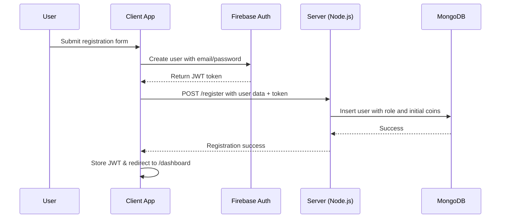
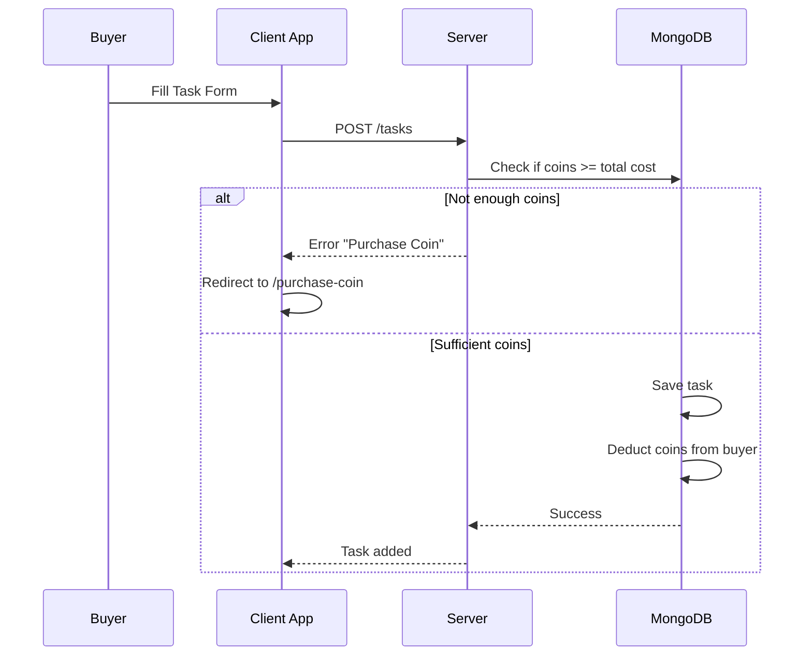
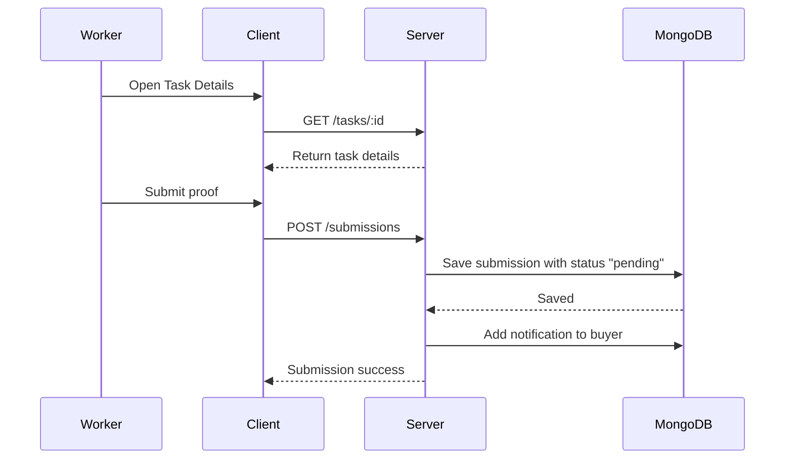
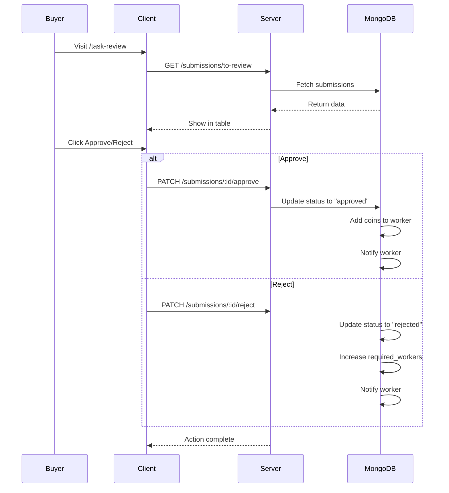
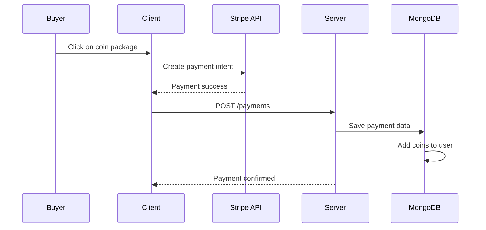
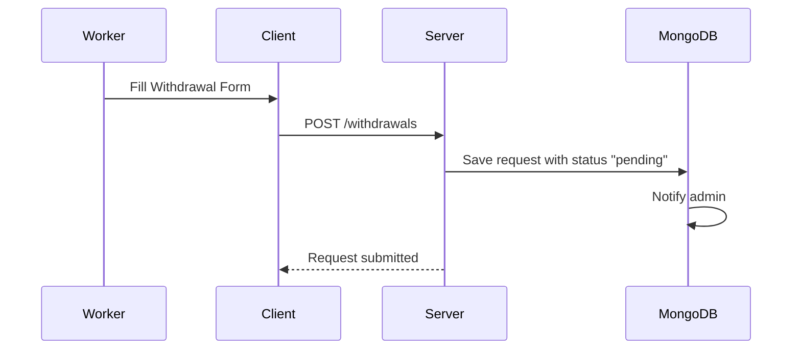
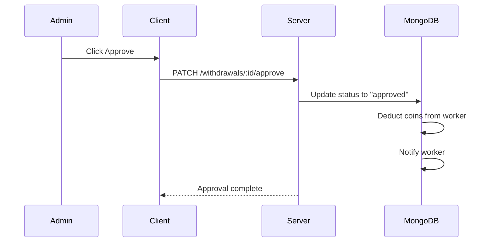
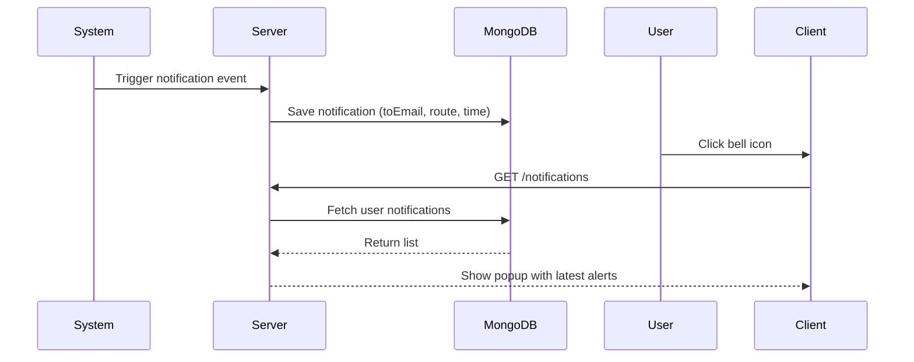

# 🔁 Micro-Task and Earning Platform – Sequence Diagrams

This document provides a clear overview of key workflows and user interactions in the Micro-Task and Earning Platform. It covers registration, task management, submissions, coin transactions, withdrawals, and admin operations through **sequence diagrams**.

---

## 🧭 Overview

The system is built using the **MERN Stack** and involves three user roles:

- **Worker** – Completes tasks and earns coins
- **Buyer** – Posts tasks and pays workers using coins
- **Admin** – Manages users, tasks, and handles withdrawal requests

The project follows a RESTful API structure, uses JWT authentication, and role-based access control.

---

## 1. 👤 User Registration (Buyer or Worker)

---

## 2. ✍️ Buyer Adds a Task

---

## 3. 🧑‍🔧 Worker Submits a Task

---

## 4. ✅ Buyer Reviews Submission

---

## 5. 💰 Coin Purchase via Stripe

---

## 6. 💸 Worker Withdraws Coins

---

## 7. 🛠️ Admin Approves Withdrawal

---

## 8. 🔔 Notifications Flow

---

## 🧠 Tips

- Use `jwt.decode()` in frontend to extract user info and role
- Always secure API routes with middleware like `verifyJWT` + `checkRole`
- Store JWT in `localStorage` or `httpOnly` cookies (recommended)
- Add loading and error states for all async actions

---

## 🧪 Tools Recommended

- [https://mermaid.live](https://mermaid.live) – for testing Mermaid diagrams
- [Draw.io](https://draw.io) – for manual visual diagrams
- [PlantUML](https://plantuml.com/) – for UML-based diagrams

---

Happy Coding! 🚀